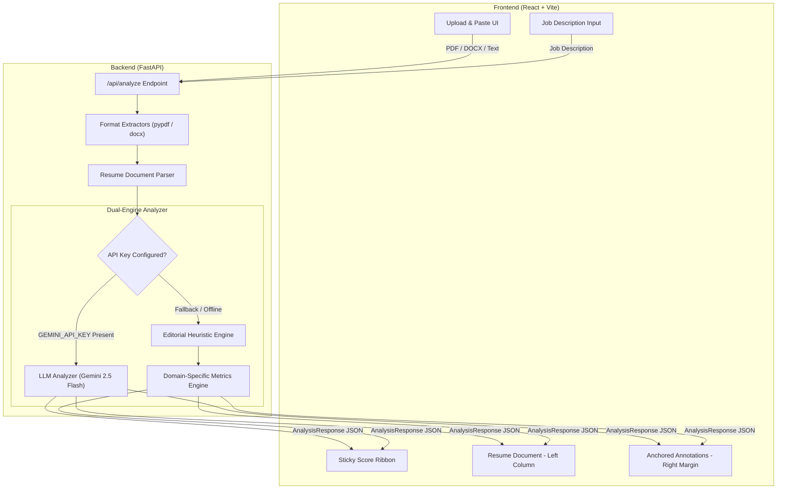

# 📄 AI Resume Analyzer — Editorial Proofreader

> An editorial-style AI resume analyzer and proofreader that treats your resume like a manuscript under review. Feedback lives in the **margins**, anchored directly to the exact line, bullet, or section it critiques.

---

## 🏛️ System Architecture



### 🔄 Data Flow & Request Lifecycle

```
[User Input: PDF/DOCX/Text + Optional JD]
                      │
                      ▼
       [FastAPI /api/analyze Endpoint]
                      │
                      ▼
   [File Extraction (pypdf / python-docx)]
                      │
                      ▼
     [Section & Bullet Tokenizer (parser.py)]
    ┌────────────────────────────────────────┐
    │ Assigns stable unique anchor IDs to    │
    │ every header, bullet, and text line    │
    │ (e.g. item-experience-1, item-skills-3)│
    └────────────────────────────────────────┘
                      │
                      ▼
   [Analysis Engine (Gemini LLM / Heuristics)]
    ┌────────────────────────────────────────┐
    │ Evaluates 5 Score Vectors:             │
    │ 1. Overall Score                       │
    │ 2. General Quality                     │
    │ 3. ATS Compatibility                   │
    │ 4. Job Description Match               │
    │ 5. Skill Gap Analysis                  │
    │                                        │
    │ Attaches margin annotations to anchor  │
    │ IDs with specific contextual fixes:    │
    │ ⚠ Amber  - Measurable outcome / passive│
    │ ✗ Red    - Skill gap / ATS layout risk │
    │ ✓ Green  - Quantified strength         │
    └────────────────────────────────────────┘
                      │
                      ▼
  [React Frontend: Dynamic Margin Layout]
    ┌────────────────────────────────────────┐
    │ Coordinates DOM bounding boxes between│
    │ Left (Manuscript) and Right (Margin)   │
    │ to align critique notes to lines       │
    └────────────────────────────────────────┘
```

---

## ✨ Key Features

- **📍 Line-Anchored Editorial Margin Notes**: Critiques appear in the right margin exactly aligned to the relevant resume bullet.
- **🎯 Context-Aware Metric Suggestions**: Instead of repetitive generic feedback, the engine analyzes the work domain of each bullet:
  - **Dashboard/UI**: Recommends time-to-insight and daily active user metrics.
  - **APIs/Backend**: Recommends request throughput, p95/p99 latency, and volume.
  - **DevOps/CI-CD**: Recommends release cycle reduction and engineering hours saved.
  - **Testing/QA**: Recommends coverage delta and regression prevention numbers.
- **📊 Sticky Multi-Score Ribbon**: Instant breakdown of Overall, General, ATS, JD Match, and Skill Gap scores.
- **🤖 Dual-Mode Engine**: Runs state-of-the-art **Gemini 2.5 Flash** for LLM analysis, with automatic fallback to a robust **offline heuristic rule engine**.
- **📑 Multi-Format Parsing**: Instant parsing support for `.pdf`, `.docx`, and raw copy-pasted plain text.
- **📱 Responsive Layout**: Automatically transitions from two-column manuscript layout to inline expandable notes on smaller screens.

---

## 🎨 Design System

Built strictly according to [`DESIGN.md`](./DESIGN.md) following an editorial manuscript aesthetic:

| Token | Hex / Value | Role |
|---|---|---|
| `--paper` | `#F1F2EE` | Primary editorial background |
| `--ink` | `#1B1D22` | High-contrast body typography |
| `--flag-amber` | `#9C6B14` | Improvement suggestions & metric warnings |
| `--flag-red` | `#8C3230` | Skill gaps & structural omissions |
| `--flag-green` | `#33593C` | Quantified strengths & strong active verbs |
| `--font-serif` | `'Source Serif 4', Georgia, serif` | Resume manuscript content |
| `--font-mono` | `'IBM Plex Mono', monospace` | Scores, margin flags, UI controls |

---

## 🛠️ Tech Stack

### Frontend
- **Framework**: React 19 + Vite
- **Styling**: Vanilla CSS Design Tokens (zero heavy framework bloat)
- **Typography**: Google Fonts (`Source Serif 4`, `IBM Plex Mono`)
- **Icons**: Custom SVG system

### Backend
- **Framework**: Python FastAPI
- **Server**: Uvicorn ASGI
- **Document Extractors**: `pypdf`, `python-docx`
- **Validation**: Pydantic v2
- **AI / LLM Integration**: Google Gemini 2.5 Flash (via HTTPX Async Client)
- **Environment**: `python-dotenv`

---

## 🚀 Getting Started

### Prerequisites
- **Node.js** (v18+)
- **Python** (v3.10+)

### 1. Clone the Repository
```bash
git clone https://github.com/amruthck177/AI_resume_analzier.git
cd AI_resume_analzier
```

### 2. Backend Setup
```bash
cd backend
python -m venv .venv

# On Windows:
.venv\Scripts\activate
# On macOS/Linux:
# source .venv/bin/activate

pip install -r requirements.txt
```

#### Configure API Key (Optional for Gemini LLM Mode)
Create `backend/.env`:
```env
GEMINI_API_KEY=your_gemini_api_key_here
```
*(Without an API key, the built-in heuristic editorial engine runs automatically)*

### 3. Frontend Setup
```bash
cd ../frontend
npm install
```

### 4. Run Development Servers

**Option A: Run everything with single command (from project root):**
```bash
npm install
node start_dev.js
```

**Option B: Run separately in two terminals:**
- **Backend**:
  ```bash
  cd backend
  .venv\Scripts\python -m uvicorn app.main:app --host 127.0.0.1 --port 8000 --reload
  ```
- **Frontend**:
  ```bash
  cd frontend
  npm run dev
  ```

Visit **`http://localhost:5173`** in your browser!

---

## 📂 Project Structure

```
AI_resume_analzier/
├── backend/
│   ├── app/
│   │   ├── __init__.py
│   │   ├── main.py          # FastAPI application & endpoints
│   │   ├── models.py        # Pydantic data schemas
│   │   ├── parser.py        # PDF/DOCX extraction & tokenization
│   │   └── analyzer.py      # Gemini LLM + Heuristic Rule Engine
│   ├── requirements.txt     # Python dependencies
│   └── .env                 # Local API keys (git-ignored)
├── frontend/
│   ├── src/
│   │   ├── components/
│   │   │   ├── AnalysisProgress.jsx   # Sequential loading checklist
│   │   │   ├── AnnotationMargin.jsx   # Anchored line alignment logic
│   │   │   ├── AnnotationNote.jsx     # Individual margin note card
│   │   │   ├── ErrorNotice.jsx        # Error fallback component
│   │   │   ├── JDInput.jsx            # Job description textarea
│   │   │   ├── ResumeDocument.jsx     # Manuscript resume renderer
│   │   │   ├── ScoreHeader.jsx        # Sticky 5-score bar
│   │   │   └── UploadDropzone.jsx     # Drag-and-drop file uploader
│   │   ├── App.css                    # Design token styles
│   │   ├── App.jsx                    # Core UI state coordinator
│   │   └── main.jsx                   # React entry point
│   ├── index.html
│   └── package.json
├── DESIGN.md                # Complete design system specification
├── README.md                # Project documentation
├── start_dev.js             # Dev orchestrator for both servers
└── package.json
```

---

## 📡 API Reference

### `POST /api/analyze`
Analyzes an uploaded resume file or plain text against an optional job description.

**Form Data Parameters:**
- `file` *(optional)*: `.pdf` or `.docx` file
- `text` *(optional)*: Plain text resume content
- `job_description` *(optional)*: Target job description text

**Response:**
```json
{
  "scores": {
    "overall": 82,
    "general": 85,
    "ats": 90,
    "jdMatch": 75,
    "skillGap": 78
  },
  "document": {
    "sections": [ ... ]
  },
  "annotations": [
    {
      "id": "ann-1",
      "anchorId": "item-experience-2",
      "flagType": "amber",
      "symbol": "⚠",
      "label": "Add Measurable Outcome",
      "fixText": "This bullet describes API development but has no measurable outcome. Add scale and impact — e.g. 'Built 8 REST endpoints handling 50 k+ req/day with < 200 ms p99 latency.'"
    }
  ]
}
```

### `GET /api/sample`
Returns pre-analyzed sample candidate data for instant preview and testing.

---

## 🛡️ License

MIT License — free for educational and commercial use.
